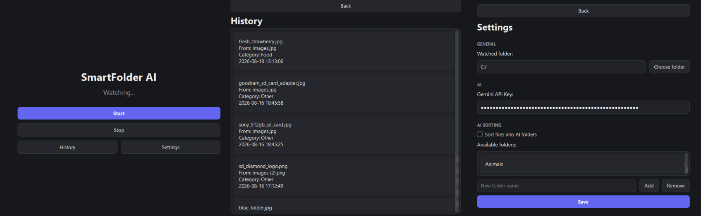

# SmartFolder AI

an ai-powered file organizer that automatically renames and sorts your images into folders.

## features

- ai-powered image sorting
- automatic file renaming
- custom folders
- history tracking
- system tray + background mode
- customizable watched folder

## download

download the latest release:

[SmartFolder AI v1.0.0](https://github.com/e-lataks/SmartFolderAI/releases/tag/v1.0.0)

download the `.zip`, extract it and run `SmartFolderAI.exe`.

## setup

1. launch SmartFolder AI
2. open `Settings`
3. enter your Gemini API key
4. choose the folder you want to watch
5. optionally enable AI sorting
6. add your custom folders
7. press `Start`

now just drop an image into the watched folder and let the AI handle it.

## how it works

SmartFolder AI watches a selected folder for new images.

when an image appears, Gemini analyzes it and returns:

- a short descriptive filename
- a category from your available folders

the app then renames and moves the image automatically.

## requirements

- Windows
- a Gemini API key
- internet connection for AI processing

## privacy

your Gemini API key is stored locally in `data/config.json`.

the key is not included in the repository or the release.

## tech

- Python
- PySide6
- Google Gemini API
- Watchdog
- PyInstaller

## status

v1.0.0 — first stable release :3
